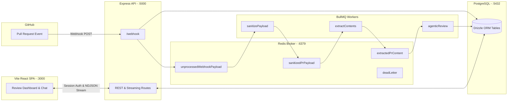

# GoBetter

> Autonomous AI-powered code reviews with zero-nitpick intelligence.

GoBetter intercepts GitHub pull requests, runs deep architectural and concurrency checks via background queues, and provides an interactive developer dashboard with chat, diff analysis, and Bring-Your-Own-Key (BYOK) model orchestration.

## Deploy GoBetter

GoBetter is a small two-part deployment: the React frontend is a static Vite app, while the Express API and BullMQ workers run together in the backend container. Redis and PostgreSQL remain shared infrastructure for queues, sessions, and application data.

<p>
    <a href="https://vercel.com/new/clone?repository-url=https%3A%2F%2Fgithub.com%2Fdev-hari-prasad%2Fgo-better&project-name=go-better&repository-name=go-better">
        
    </a>
    <a href="https://railway.com/new?repo=https%3A%2F%2Fgithub.com%2Fdev-hari-prasad%2Fgo-better">
        
    </a>
</p>

### What the buttons do

- **Vercel** creates a frontend project from this repository. The root `vercel.json` already points Vercel at `client`, runs the client build, and serves `client/dist`.
- **Railway** creates a project from this repository. Set the service root directory to `backend` so Railway uses `backend/DockerFile` and starts the API with its workers.

Both deployments still need their environment variables. Configure the client API URL in Vercel, and configure PostgreSQL, Redis, authentication, GitHub, AI provider, encryption, and email settings in Railway. For a larger production setup, provision PostgreSQL and Redis as managed services and review the migration coordination item in [`docs/todo.md`](./docs/todo.md) before running multiple backend machines.

---

## System Architecture



---

## Core Capabilities

- **Zero-Nitpick Review Engine**: Replaces noisy style/formatting linting with high-signal defect detection (concurrency races, memory leaks, security flaws, breaking contract changes).
- **Distributed Async Pipeline**: Decoupled ingestion using BullMQ and Redis queues with automatic exponential backoff retries and Dead Letter Queue (DLQ) tracking.
- **BYOK (Bring Your Own Key)**: Support for OpenAI, Anthropic, Gemini, OpenRouter, and custom OpenAI-compatible enterprise gateways, encrypted at rest using AES-256.
- **Interactive PR Chat**: Full-duplex NDJSON streaming chat with repository context tools (`getDiff`, `getPRList`) and multi-turn thread persistence.
- **Developer Dashboard**: Live quality scores, severity-badged findings, diff inspector, and one-click agentic fix prompt generation.

---

## Repository Structure

```text
go-better/
├── backend/                  # Express.js backend & BullMQ workers
│   ├── src/
│   │   ├── config/           # Queues, prompts, pricing, and database config
│   │   ├── database/         # PostgreSQL schemas (Drizzle ORM) & migrations
│   │   ├── harness/          # AI agents, repository tools, and context helpers
│   │   ├── lib/              # Redis client, key helpers, and Resend email client
│   │   ├── middleware/       # Session authentication middleware
│   │   ├── routes/           # Express REST routers (auth, review, pr, byok, etc.)
│   │   ├── service/          # AI SDK orchestration, webhook ingestion, auth logic
│   │   ├── workers/          # BullMQ queue workers (sanitizer, extractor, reviewer)
│   │   └── server.ts         # Express entry point
│   └── package.json
│
├── client/                   # React 18 + Vite + Tailwind CSS frontend
│   ├── src/
│   │   ├── components/       # UI views (reviews, analytics, chat, settings, byok)
│   │   ├── services/         # Typed API clients for backend endpoints
│   │   └── App.tsx           # Route layout and state orchestration
│   └── package.json
│
├── docs/                     # Mintlify documentation site
│   ├── api-reference/        # Full REST and streaming endpoint specifications
│   ├── architecture/         # System lifecycle and ingestion workflows
│   ├── config/               # Server and client configuration guides
│   ├── technical-guides/     # Database schemas, queue configs, harness layout
│   └── docs.json             # Mintlify site navigation
│
├── vercel.json               # Frontend deployment configuration
└── package.json              # Root scripts (docs runner)
```

---

## Local Development Quickstart

### Prerequisites
- [Node.js](https://nodejs.org/) v20+ or [Bun](https://bun.sh/)
- [pnpm](https://pnpm.io/) package manager
- Docker (for PostgreSQL & Redis)

### 1. Start Infrastructure
```bash
# Start PostgreSQL (port 5432) and Redis (port 6379)
docker run -d --name gobetter-postgres -e POSTGRES_PASSWORD=postgres -e POSTGRES_DB=gobetter_db -p 5432:5432 postgres:16
docker run -d --name gobetter-redis -p 6379:6379 redis:7-alpine
```

### 2. Configure Environment Files
```bash
cp backend/src/.env.example backend/src/.env
cp client/.env.example client/.env
```

Fill in required credentials in `backend/src/.env` (Postgres URL, Redis URL, AI Provider API key).

### 3. Install Dependencies & Run Migrations
```bash
# Setup backend & push schema
cd backend
pnpm install
pnpm run db:push

# Setup client
cd ../client
pnpm install
```

### 4. Run Services
```bash
# Terminal 1: Backend (http://localhost:5000)
cd backend && pnpm run dev

# Terminal 2: Client (http://localhost:3000)
cd client && pnpm run dev

# Terminal 3: Documentation (http://localhost:3333)
pnpm run docs:dev
```

---

## Documentation

Full documentation is available in the [`docs/`](./docs) directory and can be browsed with Mintlify:

- [Quickstart Guide](./docs/quickstart.mdx)
- [Architecture & Ingestion Flow](./docs/architecture/architecture.md)
- [Database Schema Reference](./docs/technical-guides/databaseSchema.md)
- [Queues & Background Workers](./docs/technical-guides/queueAndWorkers.md)
- [API Reference Overview](./docs/api-reference/overview.mdx)
