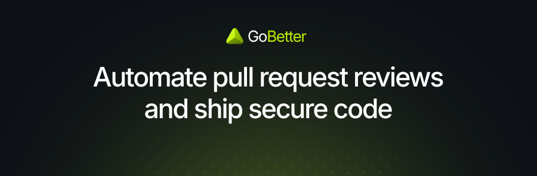
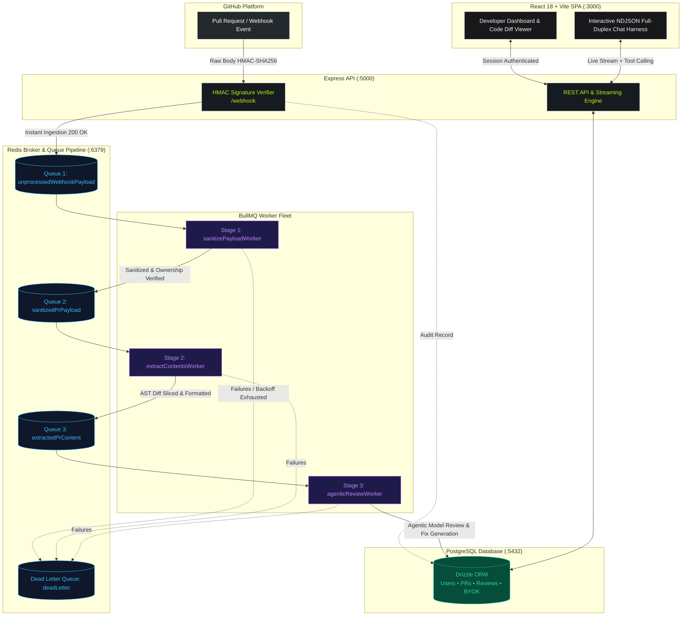

<div align="center">



# GoBetter

### Autonomous AI Code Reviews Engineered for High-Scale Engineering Teams
**Zero-Nitpick Intelligence &bull; AST-Level Defect Isolation &bull; Distributed BullMQ Queues &bull; Zero-Trust BYOK Privacy**

[](https://docs.gobetter.dev)
[](./LICENSE)
[](https://www.typescriptlang.org/)
[](https://react.dev/)
[](https://bullmq.io/)
[](https://www.postgresql.org/)
[](https://orm.drizzle.team/)

<p align="center">
  <a href="https://docs.gobetter.dev"><b>Documentation</b></a> &bull;
  <a href="https://docs.gobetter.dev/quickstart"><b>Quickstart</b></a> &bull;
  <a href="https://docs.gobetter.dev/architecture/architecture"><b>Architecture</b></a> &bull;
  <a href="https://github.com/dev-hari-prasad/go-better/issues"><b>Issues</b></a> &bull;
  <a href="./CONTRIBUTING.md"><b>Contributing</b></a>
</p>

</div>

---

## The Problem: AI Code Review Noise vs. Real Defect Detection

Most AI code review bots on the market today function as glorified linters—flooding pull requests with pedantic style comments, cosmetic renaming suggestions, and import ordering nitpicks. Engineers ignore them, PR turnaround slows down, and critical flaws slip through.

**GoBetter was engineered from the ground up to solve this.**

Instead of noisy surface-level linting, GoBetter operates as an autonomous, high-signal senior reviewer. It performs deep structural AST diff inspection to catch the bugs human reviewers dread:
- **Concurrency races & thread synchronization hazards**
- **Memory leaks, unclosed streams & unbounded buffers**
- **Security vulnerabilities, injection vectors & flawed authorization guards**
- **Breaking changes in public API contracts & database schema regressions**

All reviews are delivered with live quality scores, actionable code fixes, and an interactive developer dashboard with full-duplex conversational reasoning.

---

## Architectural Highlights: Engineering Under the Hood

GoBetter is built on an enterprise-grade, asynchronous event-driven topology designed to handle high-throughput engineering teams without blocking webhook endpoints or dropping pull request events.



### 1. Three-Stage Distributed Worker Pipeline
GitHub webhooks are accepted in `< 20ms` without performing synchronous heavy lifting:
1. **Stage 1 (`sanitizePayload`)**: Validates the GitHub user against `users.github_id`, confirms PR state, extracts commit ranges, and pushes to Stage 2.
2. **Stage 2 (`extractContents`)**: Fetches unified git diffs, parses modified files, isolates hunk boundaries, and optimizes context sizing.
3. **Stage 3 (`agenticReview`)**: Evaluates code through our zero-nitpick prompt harness, checks for concurrency/security defects, and records structured markdown reviews.
- **Resilience Guarantee**: All workers feature exponential backoff retry algorithms with automatic routing to the `deadLetter` queue upon repeated failure.

### 2. Full-Duplex Agentic Chat Harness
Developers can open an interactive conversation directly with the AI about any pull request. Powered by a live NDJSON stream and tool calling (`getDiff`, `getPRList`, `getFile`, `getTree`), the chat harness answers contextual questions, generates unit tests on the fly, and validates edge cases against full repository context.

### 3. Zero-Trust BYOK Vault with AES-256-GCM Encryption
Bring Your Own Key (BYOK) privacy is built into the architecture:
- Third-party API keys (OpenAI, Anthropic, Gemini, DeepSeek, OpenRouter, Ollama) are encrypted at rest using industry-standard **AES-256-GCM** before being written to PostgreSQL.
- Keys are decrypted strictly in memory at the moment of model dispatch and are never logged, leaked to the client, or shared across tenants.

### 4. Multi-Model Support
Switch effortlessly between models in the UI:
- **GoBetter Free**: Inception Labs Mercury-2 diffusion LLM architecture (ultra-fast code intelligence).
- **Flagship Frontier Models**: OpenAI GPT-4o, Anthropic Claude 3.5 Sonnet, Google Gemini 2.0 Flash, DeepSeek-R1.
- **Local & Enterprise Endpoints**: Self-hosted Ollama, vLLM, and custom OpenAI-compatible gateways.

---

## 🚀 1-Click Cloud Deployment

GoBetter is architected as a clean two-tier deployment: a static client SPA and a containerized backend worker engine.

### 1. Deploy Frontend on Vercel

Deploys the client dashboard (`client/`) as a high-speed global static SPA.

[](https://vercel.com/new/clone?repository-url=https%3A%2F%2Fgithub.com%2Fdev-hari-prasad%2Fgo-better&project-name=go-better&repository-name=go-better)

**What this button does:**
- Automatically provisions a Vercel project linked to your repository.
- Uses the root [`vercel.json`](./vercel.json) to set root directory to `client`, build the Vite SPA (`pnpm build`), and serve `client/dist`.
- Configures client-side rewrite rules (`/gobe-ai`, `/pull-requests`, `/byok`, `/settings`) directly to `index.html`.
- **Configuration needed**: Simply set `VITE_API_BASE_URL` in your Vercel project environment variables to your deployed backend URL.

---

### 2. Deploy Backend & Workers on Railway

Deploys the Express REST API, streaming chat endpoints, and distributed BullMQ background workers.

[](https://railway.com/new?repo=https%3A%2F%2Fgithub.com%2Fdev-hari-prasad%2Fgo-better)

**What this button does:**
- Builds and runs the containerized backend using [`backend/Dockerfile`](./backend/Dockerfile).
- Boots the Express.js API server (`PORT: 5000`) and launches all concurrent BullMQ queue workers.
- Connects automatically to Railway's managed PostgreSQL and Redis plugins.
- Executes automated Drizzle ORM schema migrations on startup.
- **Configuration needed**: Provide your database connection string (`DATABASE_URL`), Redis connection (`REDIS_HOST`, `REDIS_PORT`), GitHub Webhook secret, session secrets, and optional AI provider keys in Railway environment variables.

---

## Local Development Quickstart

### Prerequisites
- **Node.js** `v20.x` or higher (or Bun)
- **pnpm** `v9.x` (`corepack enable pnpm`)
- **Docker** (for local PostgreSQL & Redis)

### 1. Clone & Spin up Infrastructure
```bash
git clone https://github.com/dev-hari-prasad/go-better.git
cd go-better

# Launch PostgreSQL 16 & Redis 7
docker run -d --name gobetter-postgres -e POSTGRES_PASSWORD=postgres -e POSTGRES_DB=gobetter_db -p 5432:5432 postgres:16
docker run -d --name gobetter-redis -p 6379:6379 redis:7-alpine
```

### 2. Configure Environment Files
```bash
cp backend/src/.env.example backend/src/.env
cp client/.env.example client/.env
```

### 3. Install Dependencies & Push Database Schema
```bash
pnpm install

# Push Drizzle schema to local database
cd backend
pnpm run db:push
cd ..
```

### 4. Run Services
```bash
# Terminal 1: Backend API & BullMQ Workers
cd backend && pnpm run dev

# Terminal 2: React Vite Client
cd client && pnpm run dev

# Terminal 3: Mintlify Documentation (Optional)
pnpm run docs:dev
```

Open [http://localhost:3000](http://localhost:3000) in your browser.

---

## 📚 Complete Documentation

Visit **[docs.gobetter.dev](https://docs.gobetter.dev)** for comprehensive guides, deep architecture breakdowns, and full API specifications:

- 📖 **[Quickstart Guide](https://docs.gobetter.dev/quickstart)** &mdash; Get up and running in 5 minutes.
- 🏗️ **[System Architecture](https://docs.gobetter.dev/architecture/architecture)** &mdash; In-depth lifecycle of webhook ingestion and review dispatch.
- ⚡ **[Queues & Background Workers](https://docs.gobetter.dev/technical-guides/queueAndWorkers)** &mdash; Concurrency, job shapes, and retry mechanisms.
- 🗄️ **[Database Schema Reference](https://docs.gobetter.dev/technical-guides/databaseSchema)** &mdash; Drizzle schema definitions and relationship models.
- 🤖 **[AI Review Engine & Harness](https://docs.gobetter.dev/technical-guides/ai-and-harness/agentic-review)** &mdash; Prompt architecture and AST diff analyzers.
- 🔌 **[REST & Streaming API Reference](https://docs.gobetter.dev/api-reference/overview)** &mdash; OpenAPI contract for all backend routes.

---

## Contributing

We welcome contributions from the open-source community! Please review our **[Contributing Guidelines](./CONTRIBUTING.md)** for local setup steps, code of conduct, and pull request conventions.

For security disclosures, please email **`harii.codess@gmail.com`**.

---

<div align="center">

**GoBetter** &bull; Crafted with precision by [Hari Prasad](https://github.com/dev-hari-prasad) and the open-source community.

</div>
