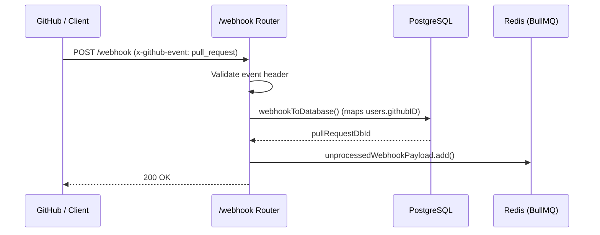

The webhook receiver is mounted at `/webhook` and acts as the entry point for GitHub pull request events.

<Note>
  In the current backend setup, `/webhook` is mounted with `authMiddleware` in `server.ts`. For production GitHub App webhooks or automated webhooks sent directly by GitHub, an exemption or HMAC signature middleware is required.
</Note>

## Endpoints

### 1. Webhook Health Check
`GET /webhook`

Returns a standard `200 OK` confirming the webhook listener is online.

---

### 2. Ingest GitHub Pull Request Event
`POST /webhook`

Receives webhook payloads from GitHub, validates the event type, upserts the pull request record in PostgreSQL, and enqueues the job into Redis.

#### Required Headers

| Header | Value | Description |
| :--- | :--- | :--- |
| `x-github-event` | `pull_request` | Event type identifier sent by GitHub. Non-PR events return `422`. |
| `Content-Type` | `application/json` | Standard JSON payload format. |

#### Ingestion Lifecycle



#### User Mapping Requirement
During ingestion, [`webhookToDatabase()`](file:///d:/hono-rabbit/backend/src/service/gitHubWebhook.service.ts#L9) matches `payload.pull_request.user.id` against `users.githubID` in PostgreSQL. If no registered user matches the GitHub user ID, the endpoint returns a `500` error:
```json
{
  "error": "Internal Server Error",
  "message": "Failed to process webhook payload"
}
```

#### Success Response
```json Response (200 OK)
{
  "message": "The request has succeeded."
}
```
