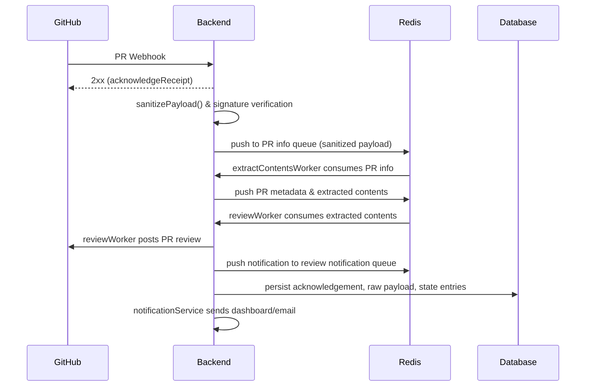
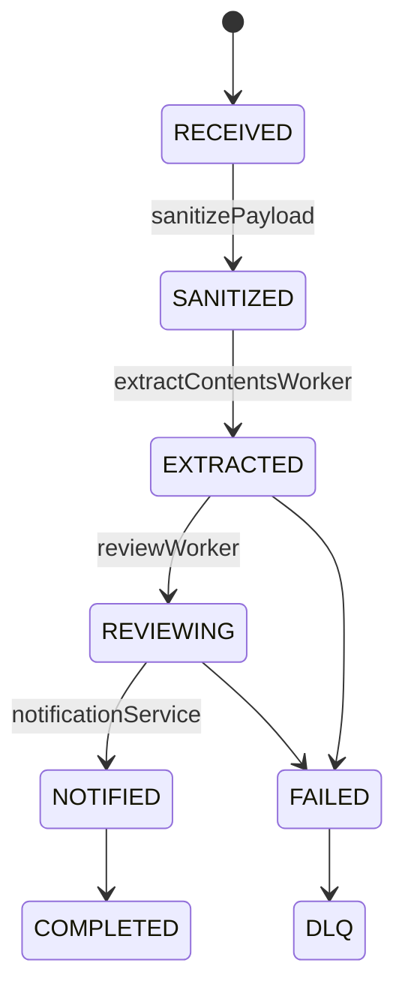
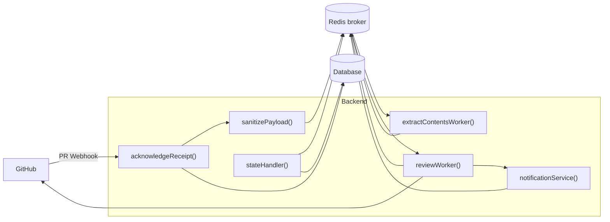

# Architecture

## Overview

A concise review pipeline triggered by GitHub pull request webhooks. The Backend accepts webhook events, enqueues work in Redis, runs workers to extract and review PR contents, writes review results back to GitHub, and notifies systems and users. A Database stores acknowledgement records, raw payloads and job state entries.

## Main Components

- **GitHub**: Sends PR webhooks and receives review submissions from the Backend.
- **Backend**: Webhook receiver and a set of workers/services that sanitize, extract, review, notify, and update state.
- **Redis broker**: Holds queues for PR info, extracted metadata/contents, review notifications, and a state log used by workers.
- **Database**: Persists acknowledgement records, the original raw payload, and job state entries.

## Backend workers / services

- `acknowledgeReceipt()`: Persist acknowledgement and return 2xx to GitHub quickly.
- `sanitizePayload()`: Sanitize incoming webhook payloads and perform signature verification.
- `extractContentsWorker()`: Extracts diffs, comments, and other resource contents available via GitHub APIs and enqueues metadata and content for downstream workers.
- `reviewWorker()`: Runs LLM reviews, aggregates findings, and issues a PR review back to GitHub.
- `notificationService()`: Sends notifications to the dashboard and email based on review outcomes.
- `stateHandler()`: Coupled with workers to update job state entries in the Redis state log and Database.

## PR flow (high level)

## Queues, state log and how they're used

- Redis queues (as shown in the diagram):
  - **PR info queue**: receives sanitized info about incoming PRs.
  - **PR metadata & extracted contents queue**: holds diffs, files, and other data produced by the extractor.
  - **Review notification queue**: carries review notifications for downstream consumers (dashboard, email).
  - **State log**: append-only entries describing job state transitions; consumed/updated by workers and `stateHandler()`.

- Workers consume from the appropriate queue (one consumer per logical responsibility) and append state updates to the state log as work progresses.

## stateHandler and state transitions

- `stateHandler()` centralizes updates: workers emit state entries to the state log and `stateHandler()` (or an equivalent process) consolidates and writes authoritative state to the Database.

## Database responsibilities

- Store acknowledgement records and the raw webhook payload sent by GitHub.
- Persist final job state and any authoritative state transitions needed for UI/observability.

## Important design considerations (from diagram)

- One consumer / two messages — avoid duplicate reviews: ensure a single consumer does not produce two reviews for two messages representing the same PR event.
- Use `X-GitHub-Delivery` header ID with a short TTL to deduplicate events and avoid re-processing the same webhook payload.
- Keep shared state-transition rules in one shared place (enum/lib) and import them into each worker so the "who can update what" invariant does not drift.
- Enforce clear invariants about which worker can update which parts of state.
- Dead-letter queue (DLQ) should enforce retry limits and backoff to avoid permanently looping jobs.
- Redis durability matters: if queues represent work you cannot lose, configure Redis persistence appropriately or consider a more durable broker as scale/reliability demands grow.

## Component diagram

---

Refer to the [Architecture diagram](./architecture/assets/architecture.excalidraw) for a visual representation of the components and their interactions.