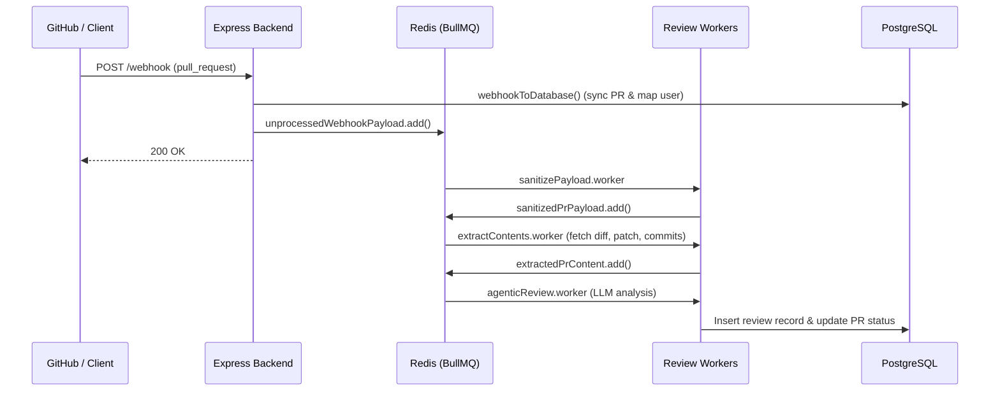
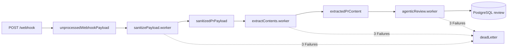

## Overview

GoBetter processes GitHub pull request events through a distributed, queue-backed pipeline. The Express backend accepts webhook events, synchronizes pull request states to PostgreSQL, queues background jobs in Redis via BullMQ, and executes LLM-driven architectural reviews with zero nitpick noise.

---

## Main Components

### 1. Ingestion Layer (`/webhook`)
- Receives GitHub `pull_request` event payloads.
- Validates the `x-github-event` header.
- Upserts the pull request into the `pull_requests` table via [`webhookToDatabase()`](file:///d:/hono-rabbit/backend/src/service/gitHubWebhook.service.ts).
- Enqueues the raw payload to BullMQ queue `unprocessedWebhookPayload` and immediately returns `200 OK`.

<Note>
  In the development setup, `/webhook` is mounted under session middleware. Standalone GitHub App deployments will utilize an HMAC secret signature verification middleware (`X-Hub-Signature-256`).
</Note>

---

## BullMQ Queue Pipeline & Workers

The processing pipeline is partitioned across dedicated Redis queues in [`backend/src/config/queue.ts`](file:///d:/hono-rabbit/backend/src/config/queue.ts):

### Worker Responsibilities

1. **`sanitizePayload.worker.ts`**:
   - Consumes from `unprocessedWebhookPayload`.
   - Strips massive GitHub webhook JSON objects down to essential metadata: PR title, body, author, URLs (`diff`, `patch`, `issue`, `comments`, `commits`), branches, and changed file metrics.
   - Pushes clean payload to `sanitizedPrPayload`.

2. **`extractContents.worker.ts`**:
   - Consumes from `sanitizedPrPayload`.
   - Concurrently fetches resource URLs (`patch`, `issue`, `comments`, `commits`, `review_comments`).
   - Assembles full patch context and pushes to `extractedPrContent`.

3. **`agenticReview.worker.ts`**:
   - Consumes from `extractedPrContent`.
   - Evaluates whether the user qualifies for the complimentary platform tier or loads decrypted BYOK provider credentials via [`checkByok()`](file:///d:/hono-rabbit/backend/src/service/ai.service.ts).
   - Prompts the LLM using `CODE_REVIEW_SYSTEM_PROMPT` and `REVIEW_MODES.DEEP_DIVE`.
   - Parses the structured JSON output with [`parseReview()`](file:///d:/hono-rabbit/backend/src/utils/parseReview.ts).
   - Persists the completed review, summary, risk rating, and commit SHA into the `review` table and marks `pull_requests.reviewStatus = 'completed'`.

4. **`cleanSessions.ts`**:
   - Background interval worker running every 15 days to purge expired authentication records from the `sessions` table.

---

## Review Output & Presentation

Review findings are stored in PostgreSQL (`rawReviewJSON` in `review` table) and rendered in real-time in the GoBetter web dashboard:
- **Quality Score**: Pre-computed 0–100 score based on agent confidence and finding severities.
- **Categorized Findings**: Anchored to specific files and line numbers with concrete failure scenarios and minimal fixes.
- **Agentic Fix Prompt**: Markdown instructions that can be copied directly into coding agents (Cursor, Windsurf, Claude Code) to remediate critical issues.

Posting comments directly to GitHub PR threads is scheduled on the active development roadmap.