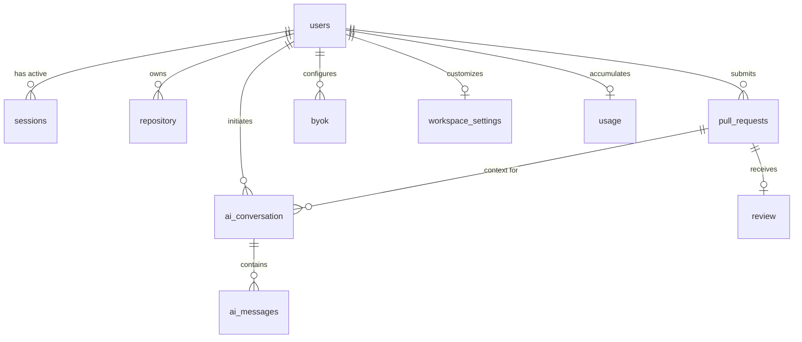

GoBetter uses **PostgreSQL** managed through **Drizzle ORM**. All schema definitions live under [`backend/src/database/schema/`](file:///d:/hono-rabbit/backend/src/database/schema/).

---

## Schema Architecture Diagram

---

## Core Schema Tables

### 1. `users`
Primary user table handling authentication credentials, notification preferences, and GitHub account linking.

| Column | Type | Constraints | Description |
| :--- | :--- | :--- | :--- |
| `user_id` | `uuid` | Primary Key, `defaultRandom()` | Unique internal user ID. |
| `user_name` | `varchar(56)` | Not Null | Display name. |
| `email` | `varchar(264)` | Unique | Lowercase email address. |
| `password` | `varchar` | Nullable | Argon2 password hash. |
| `login_method` | `enum('github', 'email')` | Not Null | Initial signup authentication method. |
| `github_profile` | `varchar` | Unique, Nullable | GitHub username handle. |
| `github_id` | `numeric` | Unique, Nullable | GitHub numeric User ID used to match webhook payloads. |
| `isActive` | `boolean` | Not Null, Default `true` | Account active flag. |
| `last_login_at` | `timestamp with tz` | Not Null, `defaultNow()` | Last successful authentication timestamp. |
| `email_notifications_enabled` | `boolean` | Not Null, Default `true` | User preference toggle for email notifications. |
| `created_at` | `timestamp with tz` | Not Null, `defaultNow()` | Registration timestamp. |

---

### 2. `sessions`
Tracks active device and browser sessions. Mirrored in Redis (`session:<id>`) with a 30-day TTL.

| Column | Type | Constraints | Description |
| :--- | :--- | :--- | :--- |
| `id` | `varchar` | Primary Key | Cryptographic session token identifier (hex string). |
| `userId` | `uuid` | Foreign Key -> `users.id` (Cascade) | Authenticated user account. |
| `expiresAt` | `timestamp` | Nullable | Session expiration date. |
| `userAgent` | `jsonb` | Nullable | Parsed client user-agent (`browser`, `os`, `platform`). |
| `createdAt` | `timestamp` | Not Null, `defaultNow()` | Session issuance timestamp. |

---

### 3. `otpVerification`
Storage table for time-sensitive OTP verification payloads for signup and password reset.

| Column | Type | Constraints | Description |
| :--- | :--- | :--- | :--- |
| `emailKey` | `varchar` | Primary Key | Lookup key (e.g. `jane@example.com` or `forgot:jane@example.com`). |
| `value` | `jsonb` | Not Null | Payload containing `hashedOtp`, `otpExpiry`, and `hashedPassword`. |

---

### 4. `workspace_settings`
Per-user AI model configurations and custom mode prompts.

| Column | Type | Constraints | Description |
| :--- | :--- | :--- | :--- |
| `id` | `uuid` | Primary Key, `defaultRandom()` | Unique configuration ID. |
| `user_id` | `uuid` | Foreign Key -> `users.id` | User owner. |
| `quick_mode_model` | `varchar` | Nullable | Model slug used for Quick review mode. |
| `focused_mode_model` | `varchar` | Nullable | Model slug used for Focused review mode. |
| `deep_mode_model` | `varchar` | Nullable | Model slug used for Deep Dive review mode. |
| `system_prompt` | `text` | Nullable | System-wide custom instruction override. |
| `quick_mode_prompt` | `text` | Nullable | Custom prompt override for Quick mode. |
| `foucsed_mode_prompt` | `text` | Nullable | Custom prompt override for Focused mode. |
| `deep_mode_prompt` | `text` | Nullable | Custom prompt override for Deep mode. |

---

### 5. `byok`
Encrypted third-party API keys and custom model endpoints.

| Column | Type | Constraints | Description |
| :--- | :--- | :--- | :--- |
| `id` | `uuid` | Primary Key, `defaultRandom()` | Provider record ID. |
| `user_id` | `uuid` | Foreign Key -> `users.id` | User owner. |
| `model_provider_name` | `varchar` | Not Null, Default `'custom'` | Provider slug: `openai`, `openrouter`, `inception`, etc. |
| `model_api_key` | `varchar` | Not Null | Symmetrically encrypted API key string (AES-256). |
| `custom_models` | `boolean` | Not Null, Default `false` | Flag indicating user-defined model IDs. |
| `custom_base_url` | `varchar` | Nullable | Custom enterprise or self-hosted gateway URL. |
| `enabled` | `boolean` | Default `true` | Active status toggle. |
| `available_models` | `jsonb[]` | Nullable | Array of probed model objects available on this provider. |
| `created_at` | `timestamp` | Not Null, `defaultNow()` | Creation timestamp. |
| `updated_at` | `timestamp` | `defaultNow()` | Last modification timestamp. |

---

### 6. `pull_requests`
Stores ingested GitHub pull request metadata, diff URLs, and sync statuses.

| Column | Type | Constraints | Description |
| :--- | :--- | :--- | :--- |
| `id` | `uuid` | Primary Key, `defaultRandom()` | Internal UUID for database joins. |
| `user_id` | `uuid` | Foreign Key -> `users.id` (Cascade) | User owner mapped from GitHub user ID. |
| `pr_id` | `numeric` | Unique, Not Null | GitHub PR numeric ID (`payload.pull_request.id`). |
| `repository_id` | `varchar` | Nullable | GitHub repository ID. |
| `repository_name` | `varchar` | Not Null | Repository name (e.g. `core-api`). |
| `pr_number` | `integer` | Not Null | Pull request number (`#42`). |
| `title` | `text` | Not Null | Pull request title. |
| `state` | `varchar(56)` | Not Null | PR state (`open`, `closed`). |
| `html_url` | `text` | Nullable | Direct GitHub PR URL. |
| `diff` | `varchar` | Not Null, Default `'0'` | Diff URL (`payload.pull_request.diff_url`). |
| `diff_content` | `text` | Nullable | Cached patch diff string. |
| `draft` | `boolean` | Not Null, Default `false` | Whether PR is marked as draft. |
| `merged` | `boolean` | Not Null, Default `false` | Merge status flag. |
| `review_status` | `varchar(56)` | Not Null, Default `'pending'` | Review pipeline state (`pending`, `completed`, `failed`). |
| `head_branch` | `varchar` | Not Null | Source branch name. |
| `base_branch` | `varchar` | Not Null | Target merge branch name. |
| `base_sha` | `varchar` | Not Null | Target branch commit SHA. |
| `head_sha` | `varchar` | Not Null | Source branch head commit SHA. |
| `merge_commit_sha` | `varchar` | Nullable | Merge commit SHA if merged. |
| `commits_count` | `integer` | Nullable | Total commits included in PR. |
| `additions` | `integer` | Nullable | Added lines counter. |
| `deletions` | `integer` | Nullable | Deleted lines counter. |
| `changed_files` | `integer` | Nullable | Count of modified files. |
| `body_blob` | `jsonb` | Not Null | Full raw webhook payload for re-reviews. |
| `created_at` | `timestamp` | Not Null, `defaultNow()` | Timestamp PR was opened. |
| `updated_at` | `timestamp` | Not Null, `defaultNow()` | Last update timestamp. |

---

### 7. `review`
Automated AI review outcomes, raw structured findings JSON, and operational execution metadata.

| Column | Type | Constraints | Description |
| :--- | :--- | :--- | :--- |
| `id` | `uuid` | Primary Key, Not Null | Matches `pullRequests.id` for direct 1:1 join. |
| `pr_id` | `numeric` | Foreign Key -> `pullRequests.prId` (Cascade) | GitHub PR ID. |
| `state` | `varchar(56)` | Not Null, Default `'WEBHOOK_RECEIVED'` | Worker pipeline state. |
| `status` | `varchar(56)` | Not Null, Default `'pending'` | Review outcome (`pending`, `completed`, `failed`). |
| `trigged_by` | `varchar` | Not Null | Review trigger source (`webhook`, `manual`). |
| `attempt_number` | `integer` | Not Null, Default `1` | BullMQ retry attempt counter. |
| `duration_ms` | `integer` | Not Null | End-to-end AI review execution time in milliseconds. |
| `review_summary` | `varchar` | Nullable | High-level review summary text. |
| `reviewed_commit_sha` | `varchar` | Nullable | Exact Git commit SHA analyzed by the agent. |
| `raw_review_json` | `jsonb` | Nullable | Full structured review payload containing comments and scores. |
| `started_at` | `timestamp` | `defaultNow()` | Job pickup timestamp. |
| `completed_at` | `timestamp` | Nullable | Final completion timestamp. |

---

### 8. `ai_conversation` & `ai_messages`
Thread containers and individual messages for PR-linked AI conversations.

#### `ai_conversation`
| Column | Type | Description |
| :--- | :--- | :--- |
| `id` | `uuid` (PK) | Conversation thread ID. |
| `userId` | `uuid` (FK) | Thread author. |
| `title` | `varchar` | Conversation title (auto-generated or custom). |
| `connected_pr` | `varchar` | Pull request title context string. |
| `connected_pr_id` | `uuid` (FK) | Foreign Key -> `pullRequests.id`. |

#### `ai_messages`
| Column | Type | Description |
| :--- | :--- | :--- |
| `id` | `uuid` (PK) | Message ID. |
| `conversation_id` | `uuid` (FK) | Foreign Key -> `aiConversation.id` (Cascade). |
| `input_message` | `text` | User prompt string. |
| `output_message` | `text` | AI model response string. |
| `used_tool_calls` | `text[]` | Array of executed tools (e.g. `["getDiff"]`). |
| `message_count` | `bigint` (Identity) | Auto-incrementing message sequence counter. |
| `llm_model` | `varchar` | Model slug used for generation. |
| `regenerated` | `boolean` | Flag indicating if response was regenerated. |
| `thumbsFeedback` | `enum('postive', 'negitive')` | User rating. |
| `input_tokens` | `integer` | Prompt token count. |
| `no_cache_input_tokens` | `integer` | Uncached prompt tokens. |
| `cache_input_read_tokens`| `integer` | Cached prompt tokens read from memory. |
| `output_tokens` | `integer` | Completion token count. |
| `output_reasoning_tokens`| `integer` | Reasoning tokens consumed (for reasoning models). |

---

### 9. `usage`
Cumulative spend tracking per user against the complimentary `$0.30` platform threshold.

| Column | Type | Constraints | Description |
| :--- | :--- | :--- | :--- |
| `id` | `uuid` | Primary Key, `defaultRandom()` | Usage record identifier. |
| `user_id` | `uuid` | Foreign Key -> `users.id`, Unique | Target user. |
| `input_cost` | `numeric` | Not Null | Cumulative cost of prompt tokens in USD. |
| `output_cost` | `numeric` | Not Null | Cumulative cost of completion tokens in USD. |
| `total_cost` | `numeric` | Generated Always As (`"input_cost" + "output_cost"`) | Virtual calculated column for total platform spend. |
| `created_at` | `timestamp` | Not Null, `defaultNow()` | Record creation timestamp. |
| `updated_at` | `timestamp` | Not Null, `defaultNow()` | Last spend update timestamp. |

---

## Schema Tooling & Migrations

For Drizzle Kit CLI commands, migration workflows, the automated runner script, and deployment safety practices, see the dedicated guide:

👉 [**Schema Tooling & Migrations**](/technical-guides/schemaToolingAndMigrations)

