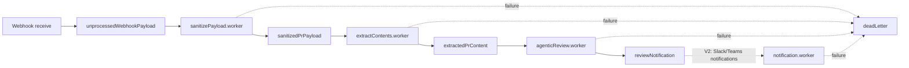

This app uses BullMQ with Redis for async processing. The pipeline is simple: receive the webhook, clean the payload, fetch PR context, and review it.

Notification delivery to external chat platforms is intentionally deferred. At the moment, GitHub handles email/in-app notifications when the bot posts a PR comment.

## Execution order

1. Webhook lands in the app route.
2. The raw GitHub payload is pushed to `unprocessedWebhookPayload`.
3. `sanitizePayload.worker.ts` reads that queue, strips the payload down to the fields we need, and pushes the cleaned object to `sanitizedPrPayload`.
4. `extractContents.worker.ts` reads `sanitizedPrPayload`, fetches patch, issue, comments, commits, and review comments, then pushes the full extracted content to `extractedPrContent`.
5. `agenticReview.worker.ts` reads `extractedPrContent`, runs the AI review, and sends the final result to `reviewNotification`.
6. `notification.worker.ts` is reserved for V2 and is currently not active.
7. If a job fails after retries, it is sent to `deadLetter`.

## Queue config

- Redis connection is shared via `connection` in `backend/src/config/queue.ts`.
- Each queue is created with BullMQ `Queue(...)`.
- Default job settings are consistent across queues:
  - `attempts: 3`
  - exponential backoff with `delay: 1000`
  - `removeOnComplete: true`
- Main queues:
  - `unprocessedWebhookPayload`
  - `sanitizedPrPayload`
  - `extractedPrContent`
  - `reviewNotification`
  - `stateLog`
  - `deadLetter`

## Flow

## Short notes

- `stateLog` is used for state tracking.
- `deadLetter` acts as the fallback queue for failed jobs after retry limits are reached.
- Worker startup is triggered in `backend/src/server.ts` by importing the worker files at boot time.
- `notification.worker.ts` is intentionally deferred for now. GitHub already handles native PR comment notifications, and this worker will be used in V2 for channels such as Slack and Microsoft Teams.

## Why workers run in the backend process

The workers currently run in the same Node.js process as the API because GoBetter is intended for internal use and the expected workload is modest. BullMQ and Redis still separate the work into durable queues, provide retries, and prevent webhook requests from waiting for the review pipeline to finish.

Running each worker in a separate process would add deployment units, process supervision, environment configuration, monitoring, and additional system resources. For the current scale, that operational complexity would outweigh the benefits of process-level isolation. If GoBetter is adopted in a larger installation or experiences substantially higher review volume, open an issue to discuss splitting workers into independently scaled processes or services.
