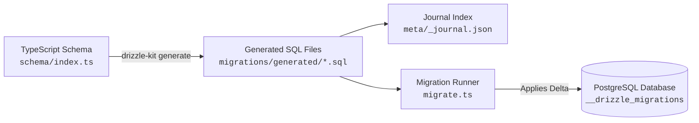

GoBetter manages all database schema migrations through **Drizzle ORM** and **Drizzle Kit**. The system relies on declarative TypeScript definitions as the single source of truth, compiling schema diffs into version-controlled SQL migration scripts before applying them to PostgreSQL.

---

## Architecture & Lifecycle

The migration pipeline follows an immutable, append-only lifecycle:



1. **Source of Truth**: Database tables, columns, relations, and enums are defined in [`backend/src/database/schema/`](file:///d:/hono-rabbit/backend/src/database/schema/).
2. **Diff Engine**: Drizzle Kit compares the TypeScript definitions against the current migration snapshot and produces a versioned SQL file.
3. **Execution**: The programmatic migration runner [`backend/src/database/migrations/migrate.ts`](file:///d:/hono-rabbit/backend/src/database/migrations/migrate.ts) applies unexecuted migrations inside a transaction and updates the tracking table.

---

## Tooling Configuration

Drizzle Kit is configured via [`backend/src/config/drizzle.config.ts`](file:///d:/hono-rabbit/backend/src/config/drizzle.config.ts):

```typescript
import { defineConfig } from 'drizzle-kit';
import 'dotenv/config';

export default defineConfig({
  schema: './src/database/schema/index.ts',
  out: './src/database/migrations/generated',
  dialect: 'postgresql',
  dbCredentials: {
    url: process.env.DATABASE_URL!,
  },
  verbose: true,
  strict: true,
});
```

### Configuration Options

| Option | Value | Purpose |
| :--- | :--- | :--- |
| `schema` | `./src/database/schema/index.ts` | Entry file re-exporting all table definitions (`users`, `pullRequests`, `reviews`, `byok`, etc.). |
| `out` | `./src/database/migrations/generated` | Target directory where generated SQL migration files and metadata journals are written. |
| `dialect` | `'postgresql'` | Targets PostgreSQL-compatible syntax (supports native UUIDs, Enums, and generated columns). |
| `dbCredentials.url` | `process.env.DATABASE_URL` | Target connection string. Used during generation and diff checks. |
| `verbose` | `true` | Prints full SQL statements and detailed diff outputs in the terminal. |
| `strict` | `true` | Requires explicit confirmation for potentially destructive operations (e.g., column drop, rename ambiguity). |

---

## CLI Commands & Workflows

All database scripts are executed from the [`backend/`](file:///d:/hono-rabbit/backend) directory:

### 1. Generate SQL Migrations (`db:gen`)

```bash
cd backend
pnpm run db:gen
```

- Analyzes changes in `src/database/schema/*.ts`.
- Prompts for disambiguation if a column was renamed or dropped.
- Creates a new timestamped file in `src/database/migrations/generated/` (e.g. `0035_smooth_thanos.sql`).
- Appends the new migration metadata to `src/database/migrations/generated/meta/_journal.json`.

### 2. Apply Migrations Programmatically (`db:migrate`)

```bash
cd backend
pnpm run db:migrate
```

- Executes [`backend/src/database/migrations/migrate.ts`](file:///d:/hono-rabbit/backend/src/database/migrations/migrate.ts) via `tsx`.
- Connects to the database and reads the internal `__drizzle_migrations` table.
- Applies all pending migration files in chronological order within a transaction.
- Logs elapsed execution time upon completion.

### 3. Direct Schema Push (`db:push` - Dev Only)

```bash
cd backend
pnpm dlx drizzle-kit push --config=./src/config/drizzle.config.ts
```

Directly synchronizes the database schema with TypeScript files without generating migration scripts.

<Warning>
**Never use `db:push` in staging or production environments.** It bypasses versioned SQL files and migration tracking history, making it impossible to perform automated rollback or audit database state.
</Warning>

### 4. Drizzle Studio

```bash
cd backend
pnpm dlx drizzle-kit studio --config=./src/config/drizzle.config.ts
```

Launches a local web UI at `https://local.drizzle.studio` to inspect tables, view foreign-key relations, run ad-hoc queries, and modify seed data during development.

---

## Programmatic Migration Runner

In production or automated deployment pipelines, migrations run via the standalone runner [`backend/src/database/migrations/migrate.ts`](file:///d:/hono-rabbit/backend/src/database/migrations/migrate.ts):

```typescript
import { drizzle } from "drizzle-orm/node-postgres";
import { migrate } from 'drizzle-orm/node-postgres/migrator';
import 'dotenv/config';
import { log } from "node:console";

const databaseUrl = process.env.DATABASE_URL;

if (!databaseUrl) {
  throw new Error('DATABASE_URL is not configured');
}

const db = drizzle(databaseUrl);

async function main() {
  try {
    const startTime = Date.now();

    await migrate(db, {
      migrationsFolder: './src/database/migrations/generated',
    });

    const elapsed = Date.now() - startTime;
    log(`✅ Migration successfully completed in ${elapsed} ms`);
  } catch (err) {
    log(`🔴 Migration failed: ${err}`);
    throw err;
  }
}

main().finally(() => db.$client.end());
```

### Key Implementation Details
- **Migration Tracking Table**: Drizzle automatically provisions a `__drizzle_migrations` table in PostgreSQL that stores migration IDs, hashes, and timestamps.
- **Atomic Operations**: Each migration file executes inside a database transaction. If any statement fails, the entire migration aborts and rolls back, preventing partial schema corruption.
- **Connection Teardown**: `db.$client.end()` explicitly closes open pool sockets so the Node process terminates cleanly in CI/CD runners.

---

## Migration Journal & File Structure

All generated migrations reside in [`backend/src/database/migrations/generated/`](file:///d:/hono-rabbit/backend/src/database/migrations/generated/):

```text
backend/src/database/migrations/
├── migrate.ts
└── generated/
    ├── 0000_sour_excalibur.sql
    ├── 0001_silky_vapor.sql
    ├── ...
    ├── 0034_amazing_sunset_bain.sql
    └── meta/
        ├── 0000_snapshot.json
        └── _journal.json
```

### Journal Metadata (`_journal.json`)

The journal tracks the sequential dependency of migration files:

```json
{
  "version": "7",
  "dialect": "postgresql",
  "entries": [
    {
      "idx": 0,
      "version": "7",
      "when": 1787231327787,
      "tag": "0000_sour_excalibur",
      "breakpoints": true
    },
    {
      "idx": 1,
      "version": "7",
      "when": 1787235060484,
      "tag": "0001_silky_vapor",
      "breakpoints": true
    }
  ]
}
```

<Note>
Commit both the `.sql` files and the `meta/` directory to Git. The journal ensures that team members and deployment pipelines execute identical migrations in the exact same sequence.
</Note>

---

## Schema Invariants & Postgres Features

When authoring schema modifications, observe these PostgreSQL-specific patterns used across the GoBetter database:

### 1. Generated Always As Columns
In the [`usage`](file:///d:/hono-rabbit/backend/src/database/schema/usage.schema.ts) table, the `total_cost` column is generated at the database level:
```typescript
total_cost: numeric('total_cost').generatedAlwaysAs(
  sql`"input_cost" + "output_cost"`
),
```
- **Rule**: Do not insert or update `total_cost` directly in application code or INSERT statements. PostgreSQL computes it automatically upon row write.

### 2. PostgreSQL Custom Enums
Enums are defined with `pgEnum`:
```typescript
export const roleEnum = pgEnum('role_enum', ['admin', 'user']);
export const reviewStatus = pgEnum('review_status_enum', ['pending', 'analyzing', 'completed', 'failed']);
```
- **Drizzle Generation Behavior**: Drizzle Kit automatically emits safe type creation blocks in generated SQL:
  ```sql
  DO $$ BEGIN
    CREATE TYPE "public"."review_status_enum" AS ENUM('pending', 'analyzing', 'completed', 'failed');
  EXCEPTION
    WHEN duplicate_object THEN null;
  END $$;
  ```

### 3. Foreign Key Cascades
Tables referencing parent records use explicit cascade behavior:
- `users.id` cascading to `sessions`, `pull_requests`, `byok`, and `workspace_settings`.
- When modifying relation keys, ensure `onDelete: 'cascade'` is declared so orphaned child rows do not block deletion.

### 4. Native UUID Generation
Primary keys utilize PostgreSQL's native random UUID generator:
```typescript
id: uuid('id').primaryKey().defaultRandom(),
```
This maps to `gen_random_uuid()` in Postgres 13+, avoiding client-side UUID generation overhead.

---

## Production Deployment Checklist

1. **Never edit generated SQL files manually** unless addressing custom data migrations (backfills). If you modify an existing migration file, you must update the corresponding snapshot in `meta/` or regenerate the migration.
2. **Release Phase Migrations**: In containerized hosting environments (Fly.io, Railway, AWS ECS, Kubernetes), execute `pnpm run db:migrate` in the deployment release hook before starting new container instances.
3. **Connection Pooling**:
   - For transactional web traffic, the backend connects through the pooled connection string (`pooler.neon.tech`).
   - For DDL migrations (`db:migrate`), ensure session timeouts are sufficient to accommodate table alterations and index builds.
4. **Non-Destructive Changes**: Use the **Expand and Contract** pattern for schema changes:
   - **Step 1 (Expand)**: Add new nullable columns or tables. Deploy application code that writes to both old and new columns.
   - **Step 2 (Backfill)**: Run data migration script to populate new columns.
   - **Step 3 (Contract)**: Drop old unused columns in a subsequent release.
